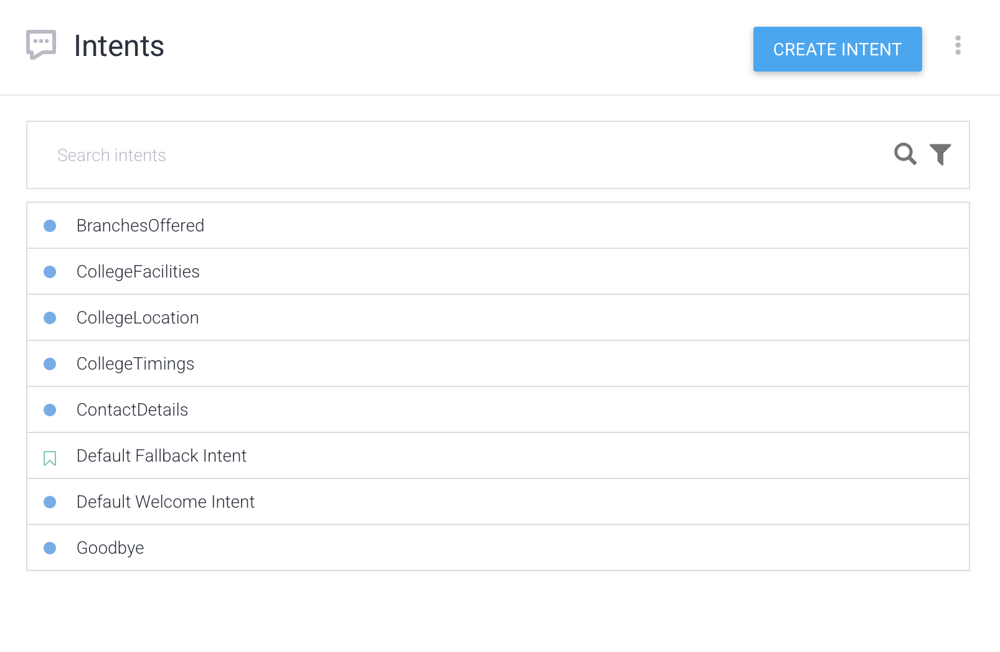

# 🎓 College Assistant Bot – Dialogflow Agent

A simple chatbot built using **Google Dialogflow** to help students access college-related information such as timings, branches, facilities, and contact details.

## 📁 Project Structure

 
📁 Click to copy clean project structure

DIALOGFLOW-COLLEGE-BOT/
│
├── CollegeAssistantBot/ # Unzipped Dialogflow agent folder
│ ├── agent.json
│ └── intents/
│ ├── Default Welcome Intent.json
│ ├── CollegeTimings.json
│ ├── BranchesOffered.json
│ ├── ContactDetails.json
│ └── ... # Any other custom intents you added
│
├── Intents.png # Screenshot showing list of intents
├── Agent.png # Screenshot showing agent details
├── WorkingOfAgent.mov # Screen recording of the bot in action
│ 
├── README.md # Project documentation

## 🚀 Features
- Greets users with a welcome message
- Provides college timings
- Lists branches/courses offered
- Shares contact and location details
- Describes college facilities

## 🛠 How to Use
1. Go to [Dialogflow Console](https://dialogflow.cloud.google.com/)
2. Create a new agent or import the one in `agent/`
3. Test it using the "Try it now" panel on the right

## 🎥 Demo

> A full working video is available in `WorkingOfAgent.mov`.

## 👥 Team
- Rostan Lobo
- Rhugved Mane
- Ben Furtado
- Joel Jose

## 📌 Note
This was created as part of our AI-DS Lab Assignment.

